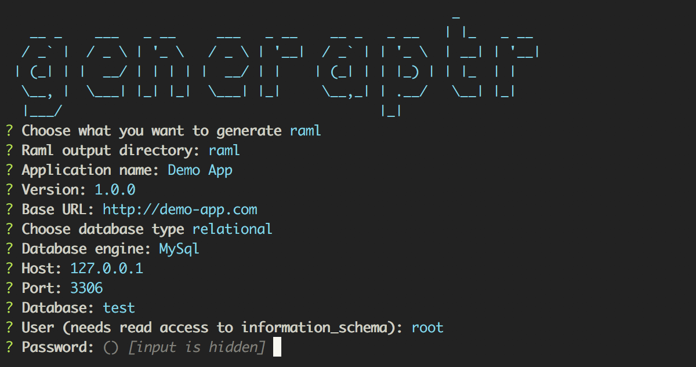
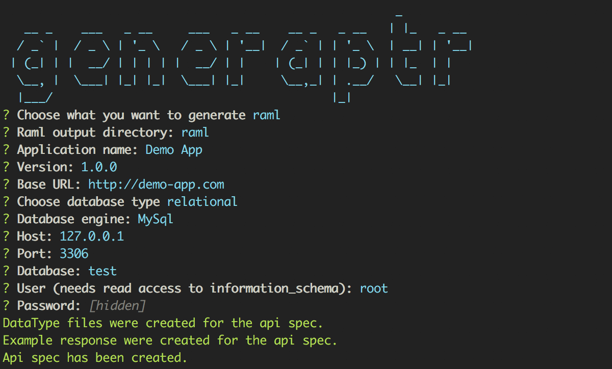
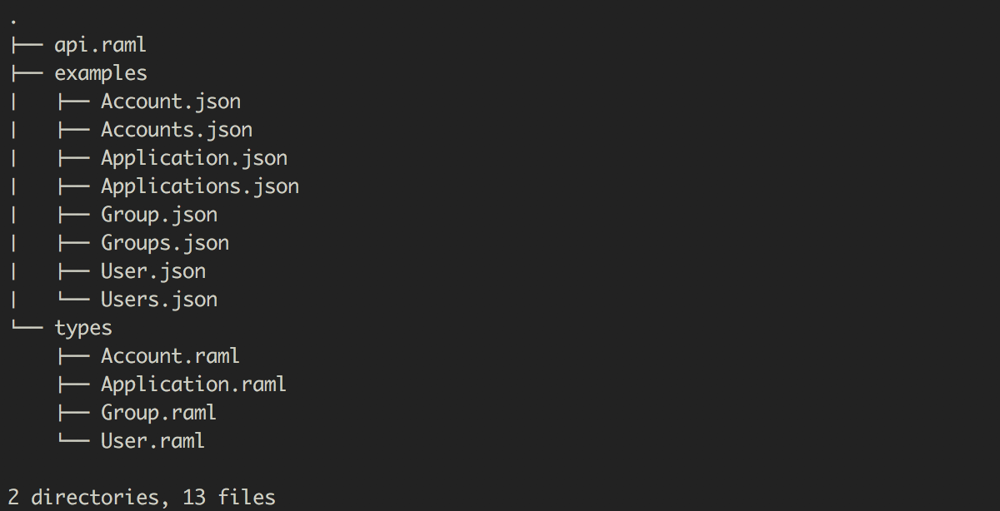
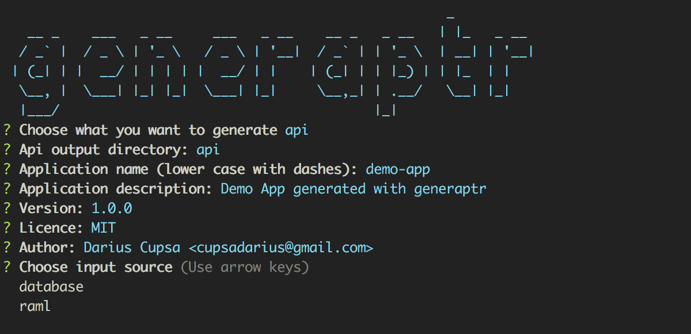
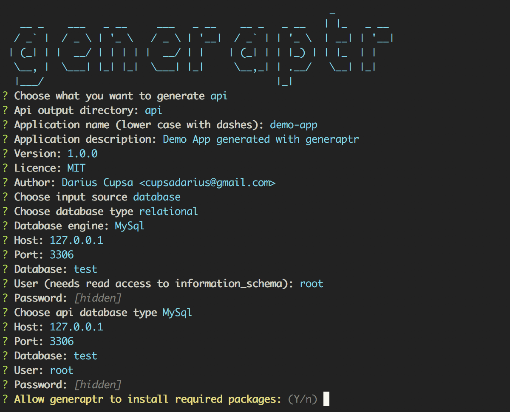
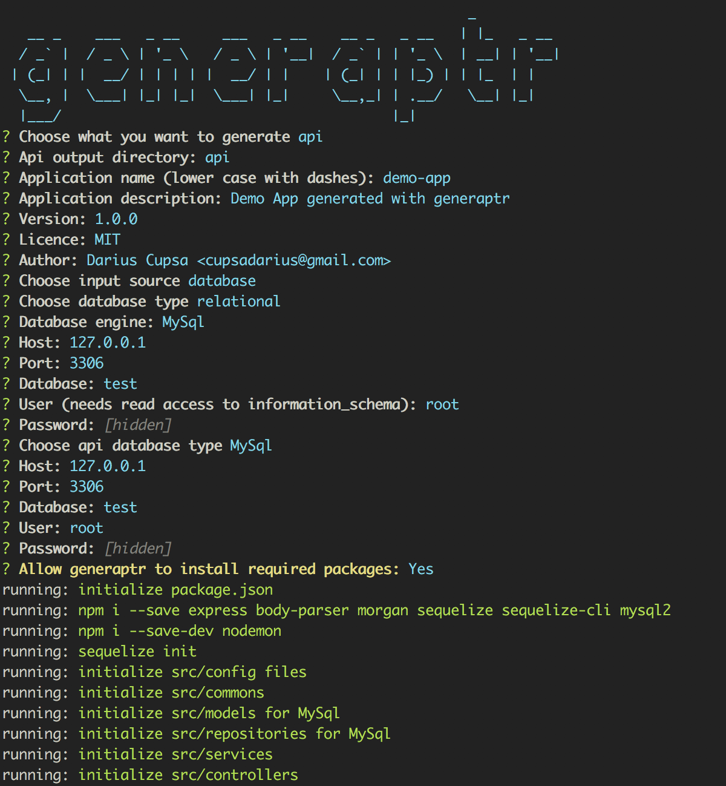
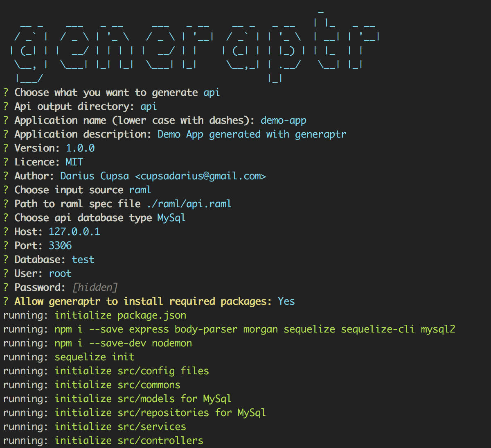
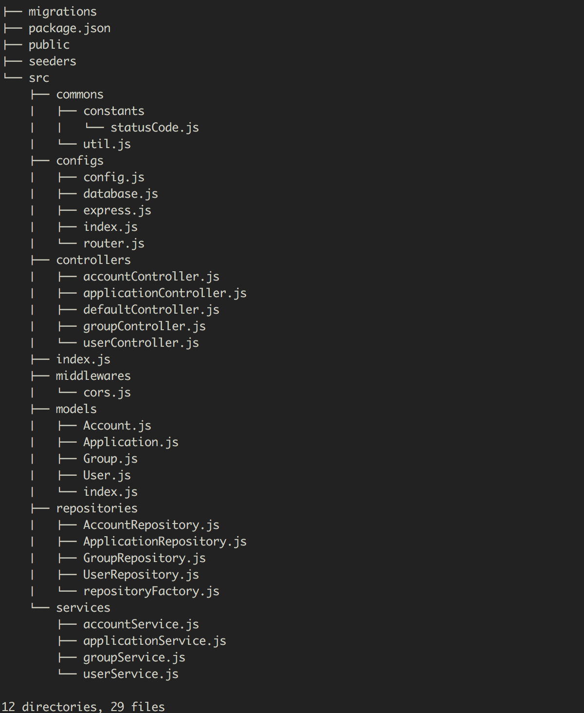

========

[](http://badge.fury.io/js/generaptr) [](http://travis-ci.org/generaptr/generaptr) [](https://gitter.im/generaptr/proposals?utm_source=badge&utm_medium=badge&utm_campaign=pr-badge&utm_content=badge) [](https://coveralls.io/github/cupsadarius/generaptr?branch=develop) [](https://david-dm.org/cupsadarius/generaptr) [](https://greenkeeper.io/)

Generaptr is a node cli package that helps when starting up a package by generating boilerplate code for Express api.

-------
## Table of Contents
1. [Documentation](#documentation)
2. [Minimum Requirements](#minimum-requirements)
3. [Installation](#instalation)
4. [Examples](#examples)
5. [Support](#support)
6. [Code of Conduct](#code-conduct)
7. [Contributing](#contributing)
8. [License](#license)
9. [References](#references)

## Goal and Philosophy
**`Generaptr`** strives to be an easy and useful command line tool for generating boilerplate api for a given database structure.
 
**`Generaptr`** should ease the process of:
- starting a new backend project
- writing boilerplate crud operations
- writing api specs

## [Documentation](#documentation)
<a name="documentation"></a>
### [Minimum Requirements](#minimum-requirements)
<a name="minimum-requirements"></a>
The package was developed under `node 7.5` so a minimum requirement would be:
* `node >= v7.5.0`
* `npm >= v3.10.10`
### [Installation](#instalation)
<a name="instalation"></a>

``` shell
npm install generaptr
```

### [Examples](#examples)
<a name="examples"></a>

When starting generaptr the screen displayed below will appear.


Here, the two possible actions are shown, actions which will decide on which flow will the execution continue:
* [raml](#raml-flow)
* [api](#api-flow)
#### [Generate Raml spec flow](#raml-flow)
<a name="raml-flow"></a>

Required information for generating the raml api spec is presented in the next screen.
 




In the screenshot we can see the logs from a successful api spec generation.



Folder structure for a generated api spec.

#### [Generate Api flow](#api-flow)
<a name="api-flow"></a> 

While generating the api boilerplate a few things are required, things which will be made clear in the next screenshots.



In the screenshot above the user is prompted to choose the input source, right now we support a database connection or a valid raml spec (works best with raml spec's generated by generaptr).


In the screenshot above presents the database output choice, currently we only support MySql but more will come in the future.





In the last two screenshots we can see the logs from a successful api generation.



Following the same steps but with a different input source renders the same result.



Folder structure for a generated api boilerplate.

## [Support](#support)
<a name="support"></a>
You should expect mostly good support for the CLI below. This does not mean we won't
look at issues found on other command line - feel free to report any!

- **Mac OS**:
  - Terminal.app
  - iTerm
- **Windows**:
  - cmd.exe
  - Powershell
  - Cygwin
- **Linux (Ubuntu, openSUSE, Arch Linux, etc)**:
  - gnome-terminal (Terminal GNOME)
  - konsole
## [Code of Conduct](#code-conduct)
<a name="code-conduct"></a>

See [Code of Conduct](./CODE_OF_CONDUCT.md) for more information.
## [Contributing](#contributing)
<a name="contributing"></a>

**Unit test**

Unit test are written in [Mocha](https://mochajs.org/) and [Assert](https://nodejs.org/api/assert.html). Please add a unit test for every new feature or bug fix. `npm test` to run the test suite.

**Documentation**

Add documentation for every API change. Feel free to send typo fixes and better docs!

## [License](#license)
<a name="license"></a>

Copyright (c) 2017 Darius Cupsa (twitter: [@cupsadarius](https://twitter.com/cupsadarius))
Licensed under the MIT license.
## [References](#references)
<a name="references"></a>
* [RAML](http://raml.org)
* [Inquirer.js](https://github.com/SBoudrias/Inquirer.js/)
* [Express.js](https://expressjs.com)

